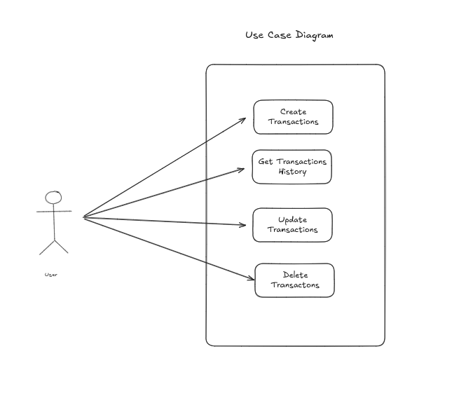
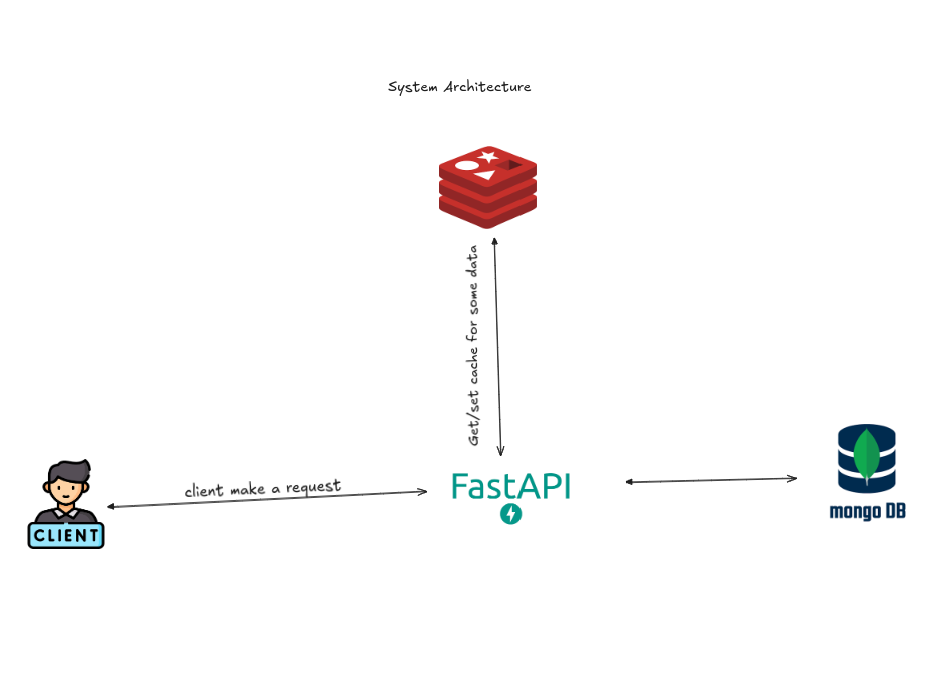
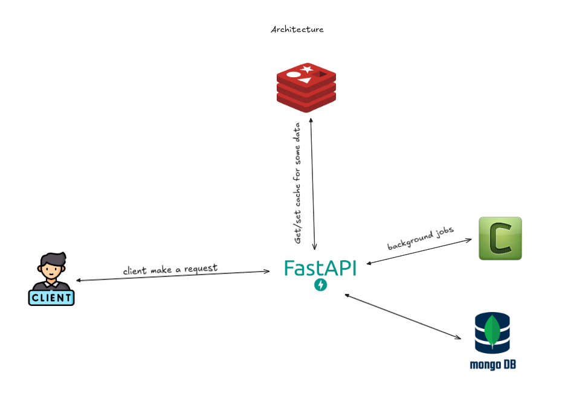

# Transactions API 
A simple API to manage user transactions

## Table of Contents

1. [Project Setup](#project-setup)
2. [Usage](#Usage)
4. [Running Tests](#running-tests)
5. [Project Documentation](#project-documentation)


<!-- GETTING STARTED -->

## Project Setup

To get a local copy up and running follow these steps.

### Prerequisites

To install you need docker and python installed on your system

### Local Setup

- Clone the repository

  ```sh
  git clone https://github.com/Ahurein/fido.git
  ```
- Navigate to directory
    ``` sh
    cd fido
    ```
- Create .env and .env.prod using the .env.example as template. In .env.prod, IP or host address should be the service name in docker-compose.yml
- Build the images
    ``` sh
    sudo docker compose build --no-cache
    ```
- Run the application
    ``` sh
    sudo docker compose up -d
    ```
- Stop the application
  ``` sh
  sudo docker compose down
  ```
  The logs indicate the application is running
  ``` sh
  [+] Running 4/4
   ✔ Network fido_app-network  Created                                                                                                                                                                                           0.2s 
   ✔ Container fido_redis      Started                                                                                                                                                                                           0.6s 
   ✔ Container fido_mongodb    Started                                                                                                                                                                                           0.6s 
   ✔ Container fido_api        Started
  ```
### Usage
The table show the service and port it is running on

| **Service**     | **Port**                      |
|-----------------|-------------------------------|
| `api`           | [8080](http://localhost:8080) |
| `mongodb`       | 27017                         |
| `redis`         | 6379                          |
| `redis-insigth` | [8001](http://localhost:8001) |


#### Docs
Swagger docks url: http://localhost:8080/docs

## Running Tests
Run the tests using this command
```bash
pytest
```
--- 

## Project Documentation
### Design And Architectural Decisions
The use case diagram below briefly illustrate the actions a user can perform with api


##### Tools Used
* **MongoDB**: The database used is MongoDB with Beanie ODM. MongoDB is an ideal solution for handling unstructured data, as fields can be easily added. Additionally, I chose a NoSQL database to align with what Fido currently uses.<br />
* **Beanie**: The ODM provides good integration with MongoDB, and its asynchronous behavior works well with FastAPI.
* **Fernet**: Used to encrypt sensitive fields before saving them in the database.
* **Redis**: Serves as a caching layer to speed up the request-response cycle by caching frequently accessed data.
* **FastAPI**: The main backend framework, which provides automatic documentation and strong asynchronous capabilities.

##### Encryption
**Reasons why cached data in Redis is not encrypted:**

* **Performance**: Encrypting and decrypting data can impact the speed of operations. For example, with a large amount of data, decrypting cached data can affect the performance of read operations, which we aim to improve by using Redis.
* **Short time to live**: Cached data has a very short lifespan. The data is automatically cleared when it expires, reducing the load on the backend.


#### Current System Architecture


* **Read Operations**: When the server receives a request, it performs a lookup in Redis. If the data exists, it returns a response to the user. If no key matches the client request, the database is queried, Redis is updated, and a response is sent to the user.
* **Write Operations**: With write operations, the cached data for the specific key is cleared after the database is modified. Because of the short lifespan of cached data, we don't immediately update the cache, as it’s highly possible that the data might have expired by the time the user performs a read operation.


### Scaling Strategies
We can scale the application and improve performance by considering the strategies below:

* **Index**: Indexing fields regularly used for search, sort and filtering as I've done for `user_id`
* **Background Jobs**: Updating user statistics, alerting relevant systems, or recalculating credit scores. Using FastAPI background tasks won't be efficient with a growing user base; therefore, opting for a solution like Celery is recommended.
* **Message Queues**: Using RabbitMQ and Kafka for an event-driven approach.
* **Microservices**: Offloading the calculation of statistics to another service.
* **A Good Caching Strategy**: Read-through is good for our current implementation, but if there are more write operations, opting for write-behind will enhance performance.


The diagram below detail how we can leverage celery to do the update, alerting etc. on the background to enhance system responsiveness.



With the current application, for example we can introduce a new collection called `fido_user_statistics` with the following properties to speed up user transactions statistics
``` text
fido_user_statistics
  - user_id: ObjectId
  - highest_transaction_day : str
  - average_transaction: float
  - total_transaction: float
```
For write operations related to transactions, we run a background job to update the values and save the latest changes in Redis. This greatly increases performance when retrieving user transaction statistics and reduces the load on the backend.


#### Trade-offs
* **Complexity**: Event-driven architecture, background jobs, and microservices introduce complexity into the application. We have to ensure data consistency and integrity across distributed services.
* **Cost**: Introducing new services requires provisioning new infrastructure to run the system, which also needs to be maintained.
* **Onboarding New Developers**: With so many moving parts, onboarding new developers can take a while.

